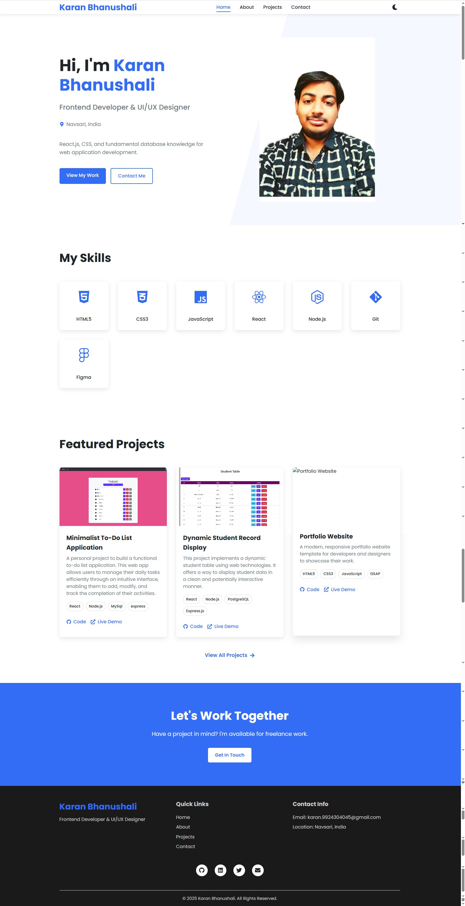
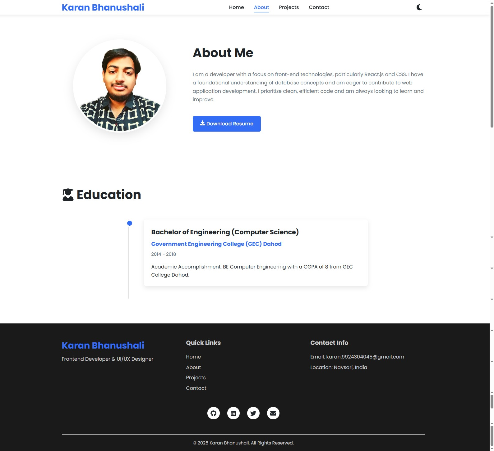
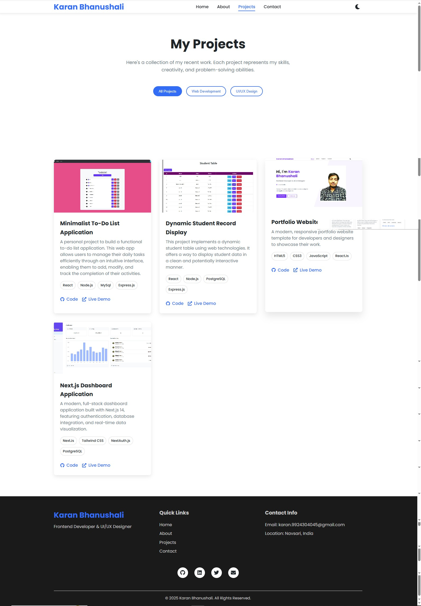
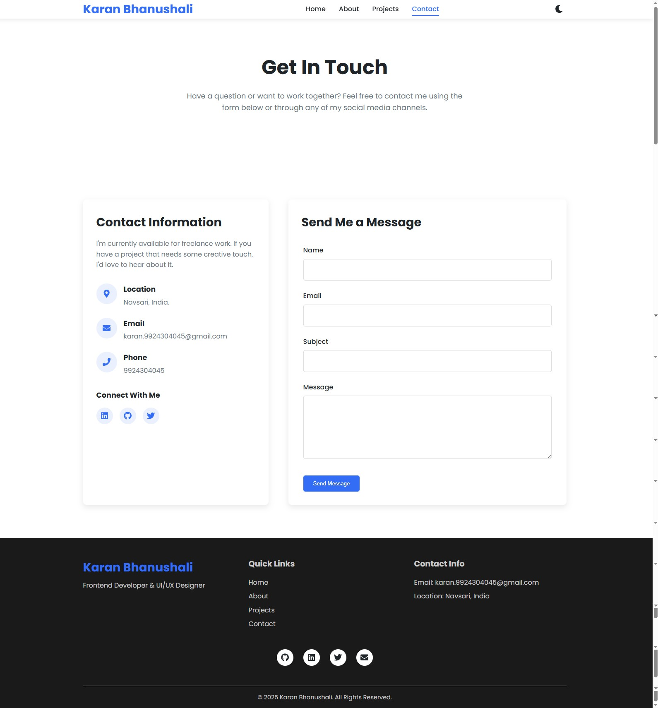

# Portfolio-Website

A personal portfolio website to showcase your projects, skills, and experiences. Built primarily with modern web technologies, this repository is designed to help you establish a professional online presence.

## Features

- Clean and modern design
- Responsive layout for mobile and desktop
- Project showcase section
- About/Bio section
- Contact form or contact information
- Easy customization

## Technologies Used

- **React.js** — Component-based frontend framework for building interactive UIs
- **HTML5 & CSS3** — Markup and styling for the web
- **JavaScript** — Core scripting language for dynamic behavior
- **GSAP** — Animation library for smooth transitions and effects
- **Node.js** (in sample projects) — Backend JavaScript runtime
- **Express.js** (in sample projects) — Web server framework for Node.js
- **PostgreSQL & MySQL** (in sample projects) — Database systems
- **Next.js** (in sample projects) — React framework for SSR/SSG
- **Tailwind CSS** (in sample projects) — Utility-first CSS framework
- **NextAuth.js** (in sample projects) — Authentication for Next.js
- **Git** — Version control
- **Figma** — Design and prototyping

> _Note: The main Portfolio Website uses React, HTML5, CSS3, JavaScript, and GSAP. Other technologies are demonstrated in showcased projects._

## Installation

1. **Clone the repository:**
   ```bash
   git clone https://github.com/karanhb-pixel/Portfolio-Website.git
   cd Portfolio-Website
   ```

2. **Install dependencies:**
   ```bash
   npm install
   ```

3. **Start the development server:**
   ```bash
   npm start
   ```
   > _Or open the `index.html` file directly in your browser if it is a static site._

## Usage

- Customize the content in the source files to add your own projects, skills, and information.
- Update images and assets as needed.
- Deploy to your preferred hosting provider (GitHub Pages, Vercel, Netlify, etc.).

## Screenshots

Below are screenshots of the main pages of the Portfolio Website. All images are stored in the `public/ReadMe_images` folder.

### Home Page


### About Page


### Projects Page


### Contact Page


## Contributing

Contributions are welcome! Please open an issue or submit a pull request for any improvements or suggestions.

## License

This project is open source. See the [LICENSE](LICENSE) file for more details.

## Contact

Created by [karanhb-pixel](https://github.com/karanhb-pixel)  
Feel free to reach out for collaboration or feedback!
